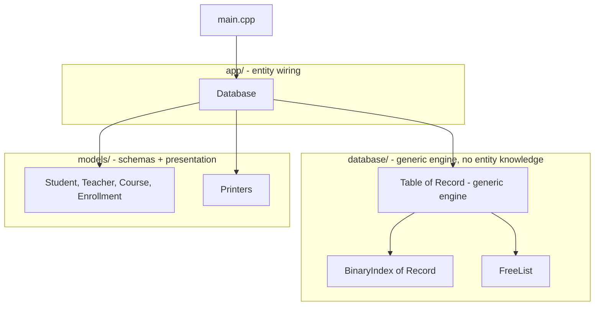

# Build Database — A C++ Storage Engine From Scratch

A database storage engine written from scratch in C++, with no external libraries or frameworks. The goal isn't to build a production database — it's to understand, by building, how real storage engines manage binary files, indexes, and deleted space on disk.

This version's core design principle: **the storage engine has zero knowledge of what it's storing.** It doesn't know about students, teachers, or courses — it only knows about fixed-size binary records, byte offsets, and IDs. Everything entity-specific lives in a separate application layer that sits on top of the engine.

---

## Architecture



- **Engine layer** (`include/database/`, `src/database/`) — `Table<Record>`, `BinaryIndex<Record>`, `FreeList`. Pure, generic, reusable for any fixed-size struct. Contains no reference to any specific entity.
- **App layer** (`app/`) — `Database`, the only place that binds a struct (`Student`, `Teacher`, ...) to a data file, a free-list file, and an ID accessor.
- **Model layer** (`include/models/`) — the record structs (schema, currently defined at compile time) and small presentation helpers (`Printers.h`) for displaying them.

Adding a new entity means writing a struct + a few lines in `Database.h`/`.cpp` — never touching the engine.

---

## Core concepts implemented

### 1. Binary, fixed-size records
Each record (`Student`, `Teacher`, `Course`, `Enrollment`) is a POD struct written to disk with a raw `write(reinterpret_cast<const char*>(&record), sizeof(Record))`. Fixed-width fields (`char[N]`) make every record the same size, which is what makes random access possible.

### 2. Random file access
Instead of loading an entire file into memory to find or update a record, the engine seeks directly to the record's byte offset:
```cpp
file.seekg(position);   // move the read pointer
file.seekp(position);   // move the write pointer
```
This avoids reading/rewriting the whole file for a single record.

### 3. In-memory hash index — O(1) lookup
[`BinaryIndex<Record>`](include/database/Index.h) builds an `unordered_map<int, streamoff>` (ID → byte offset) by scanning the file once. After that, finding a record by ID is O(1) instead of an O(n) linear scan.

### 4. Logical deletion + free list
Deleting a record doesn't erase it or shift file contents — it flips an `isDeleted` flag in place. The freed byte offset is pushed onto a [`FreeList`](include/database/FreeList.h) (a simple on-disk stack of positions). The next insert pops from the free list before appending, so deleted space gets reused instead of the file growing forever.

### 5. Generic storage engine (`Table<Record>`)
[`Table<Record>`](include/database/Table.h) is a single templated class implementing `insert` / `update` / `remove` / `findById` / `scanAll`, combining points 1–4 above. It works for *any* record type that has an `int`-returning ID accessor and an `isDeleted` field — there is no per-entity duplicate CRUD code anywhere in this codebase.

---

## Project structure

```text
database_github_connected/
├── main.cpp                     # demo entry point
├── app/
│   ├── Database.h                # the ONLY place entity <-> storage wiring exists
│   └── Database.cpp               # file paths + id-accessor lambdas per entity
├── include/
│   ├── database/                 # ── generic engine, no entity knowledge ──
│   │   ├── Table.h                # generic insert/update/remove/find/scan
│   │   ├── Index.h                # generic hash index (id -> file offset)
│   │   └── FreeList.h             # generic on-disk stack of reusable offsets
│   └── models/
│       ├── Student.h / Teacher.h / Course.h / Enrollment.h   # record schemas
│       └── Printers.h             # per-struct display helpers
├── src/
│   └── database/
│       └── FreeList.cpp
└── data/
    ├── students.dat / .fre
    ├── teachers.dat / .fre
    ├── courses.dat / .fre
    └── enrollments.dat / .fre
```

---

## Building and running

There's no build system yet — compile directly with `g++`:

```bash
g++ -std=c++17 -Wall main.cpp app/Database.cpp src/database/FreeList.cpp -o database_app
```

> **Note:** data file paths (`../../data/students.dat`, etc.) are currently relative and assume the binary runs from a directory two levels below the project root, e.g. `src/database/`. Run it from there:

```bash
mv database_app src/database/
cd src/database
./database_app
```

## Example usage

```cpp
#include "app/Database.h"
#include "include/models/Printers.h"

int main()
{
    Student student{};
    student.studentID = 1;
    student.setStudentName("Ada Lovelace");
    student.setEmail("ada@example.com");
    student.isDeleted = false;

    Database db;
    db.students.insert(student);

    for (const auto& s : db.students.scanAll())
        printStudent(s);
}
```

Every entity (`students`, `teachers`, `courses`, `enrollments`) exposes the same `Table<Record>` API: `insert`, `update(id, record)`, `remove(id)`, `findById(id)`, `scanAll()`.

---

## Design journey

This engine evolved in stages, each one replacing a naive approach with a technique closer to how real databases work:

1. **Whole-file read/write** → replaced with **random file access** (`seekg`/`seekp`/`tellg`/`tellp`), so operations touch only the record they need instead of the entire file.
2. **Linear search (O(n))** → replaced with an **in-memory hash index** (O(1)) mapping ID → byte offset.
3. **Physical deletion** (shifting records, rewriting the file) → replaced with **logical deletion + a free list**, so deleted slots are marked and reused instead of causing file rewrites or unbounded growth.
4. **One hand-written `*Db` class per entity** (`StudentDb`, `TeacherDb`, `CourseDb`, `EnrollmentDb` — each duplicating the same insert/update/remove/index/free-list logic) → collapsed into **one generic `Table<Record>` template**.
5. **Storage logic mixed into the same layer as entity definitions** → **separated into an engine layer (no entity knowledge) and an app layer (entity wiring)**, so the engine folder can be reused for any future schema without modification.

---

## Roadmap

### Next up: filtering and sorting

`scanAll()` currently returns every non-deleted record in insertion order. The next step is a small query layer built on top of it, so callers can narrow and order results without writing that logic themselves:

- **Sorting** — order a scan's results by any field (ID, name, age, ...) instead of raw insertion order, using `std::sort` (Introsort, O(n log n)).
- **Filtering** — return only records matching a condition, e.g. "age > 20", "name starts with A", "age between 18 and 25". This is the foundation of SQL-style `WHERE` clauses.

Both would live in the app/query layer on top of `Table<Record>` — the engine itself stays unchanged, since it only deals with raw records and offsets.

### Later

- **Runtime schemas** — define tables via a `Schema` (column name/type/size) at runtime instead of a compile-time C++ struct, so adding a table doesn't require writing new C++ types at all.
- **Variable-length fields** — move beyond fixed-width `char[N]` padding toward slotted pages, the technique real engines use for variable-length rows.
- **A real build system** — replace manual `g++` invocations with a `CMakeLists.txt` or `Makefile`.
- **B+ tree index** — replace/augment the hash index for range queries and ordered scans.
- **Concurrency & transactions** — the next big leap once the on-disk format is solid.
